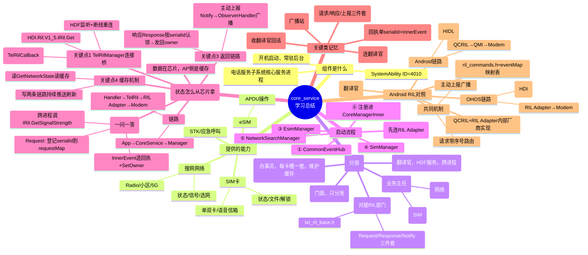

```mermaid
mindmap
  root((core_service<br/>学习总结))
    组件是什么
      电话服务子系统核心服务进程
      SystemAbility ID=4010
      开机启动、常驻后台
    提供的能力
      SIM卡
        状态/文件/解锁
        单双卡/语音信箱
      搜网网络
        状态/信号/选网
        Radio/小区/5G
      eSIM
        APDU操作
      STK/应急呼叫
    代码架构(分层)
      CoreService(门面，只分发)
      Manager(业务主任)
        NetworkSearchManager(网络)
        SimManager(SIM)
      Handler(办事员，每卡槽一套，维护缓存)
      TelRilManager+TelRilXxx(对接RIL部门)
        Request/Response/Notify 三件套
        tel_ril_base.h
      RIL Adapter(翻译官，HDF服务，跨进程)
    启动流程
      ① CommonEventHub
      ② TelRilManager(先连RIL Adapter)
      ③ EsimManager
      ④ SimManager
      ⑤ NetworkSearchManager
      ⑥ 注册进 CoreManagerInner
    核心链路(状态怎么从芯片拿)
      数据在芯片，AP侧是缓存
      链路
        App→CoreService→Manager
        Handler→TelRil→RIL Adapter→Modem
      关键点1 TelRilManager连接桥
        HDI.Ril.V1_5.IRil.Get
        SetCallback1_5(TelRilCallback)
        HDF监听+断线重连
      关键点2 请求链路(一问一答)
        InnerEvent造回执+SetOwner
        Request: 登记serialId到requestMap
        跨进程调IRil.GetSignalStrength
      关键点3 返回链路
        响应Response按serialId认领→发回owner
        主动上报Notify→ObserverHandler广播
      关键点4 缓存机制
        读GetNetworkState读缓存
        写两条链路持续推送刷新
    关键类记忆
      TelRilManager(连翻译官)
      TelRilBase(请求/响应/上报三件套)
      TelRilCallback(收翻译官回话)
      TelRilRequest(回执单serialId+InnerEvent)
      ObserverHandler(广播站)
    Android RIL对照
      Android链路
        Framework→rild(HIDL)
        QCRIL→QMI→Modem
      OHOS链路
        App→CoreService→tel_ril(HDI)
        RIL Adapter→Modem
      共同机制
        请求带序号路由
        主动上报广播
      rild≈RIL Adapter(翻译官)
      QCRIL≈RIL Adapter内部厂商实现
      ril_commands.h≈eventMap映射表
```
