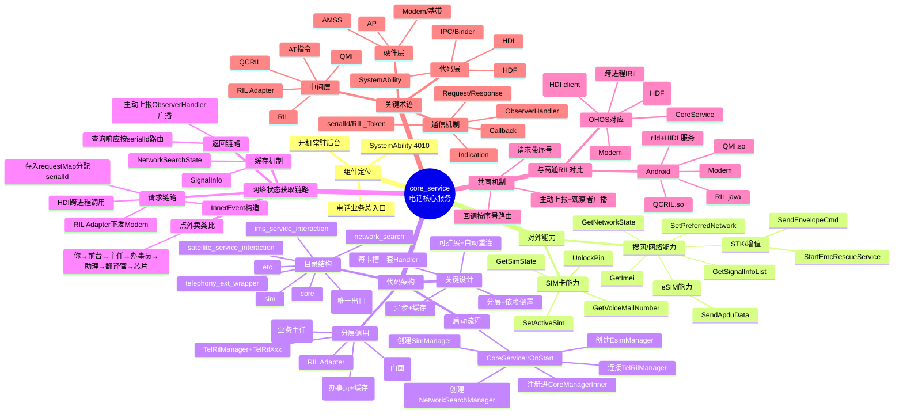

```mermaid
mindmap
  root((core_service<br/>电话核心服务))
    组件定位
      SystemAbility 4010
      开机常驻后台
      电话业务总入口
    对外能力
      SIM卡能力
        GetSimState
        UnlockPin
        SetActiveSim
        GetVoiceMailNumber
     搜网/网络能力
        GetNetworkState
        GetSignalInfoList
        SetPreferredNetwork
        GetImei
      eSIM能力
        SendApduData
      STK/增值
        SendEnvelopeCmd
        StartEmcRescueService
    代码架构
      目录结构
        core
        network_search
        sim
        tel_ril(唯一出口)
        ims_service_interaction
        satellite_service_interaction
        telephony_ext_wrapper
        etc
      启动流程
        CoreService::OnStart
          连接TelRilManager
          创建SimManager
          创建NetworkSearchManager
          创建EsimManager
          注册进CoreManagerInner
      分层调用
        CoreService(门面)
        Manager(业务主任)
        Handler(办事员+缓存)
        TelRilManager+TelRilXxx
        RIL Adapter
      关键设计
        分层+依赖倒置
        每卡槽一套Handler
        异步+缓存
        可扩展+自动重连
    网络状态获取链路
      请求链路
        InnerEvent构造
        存入requestMap分配serialId
        HDI跨进程调用
        RIL Adapter下发Modem
      返回链路
        查询响应按serialId路由
        主动上报ObserverHandler广播
      缓存机制
        NetworkSearchState
        SignalInfo
      点外卖类比
        你→前台→主任→办事员→助理→翻译官→芯片
    与高通RIL对比
      Android
        RIL.java
        rild+HIDL服务
        QCRIL.so
        QMI.so
        Modem
      OHOS对应
        CoreService
        RIL Adapter(HDF)
        TelRil(HDI client)
        跨进程IRil
        Modem
      共同机制
        请求带序号
        回调按序号路由
        主动上报+观察者广播
    关键术语
      硬件层
        AP
        Modem/基带
        AMSS
      中间层
        RIL
        RIL Adapter
        QCRIL
        QMI
        AT指令
      代码层
        SystemAbility
        HDI
        HDF
        IPC/Binder
      通信机制
        Request/Response
        Indication
        serialId/RIL_Token
        Callback
        ObserverHandler
```
